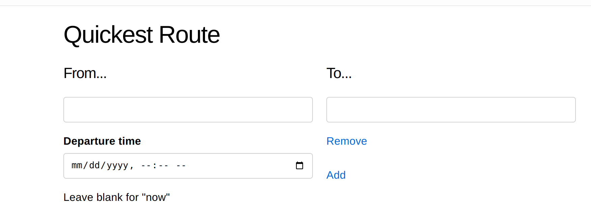
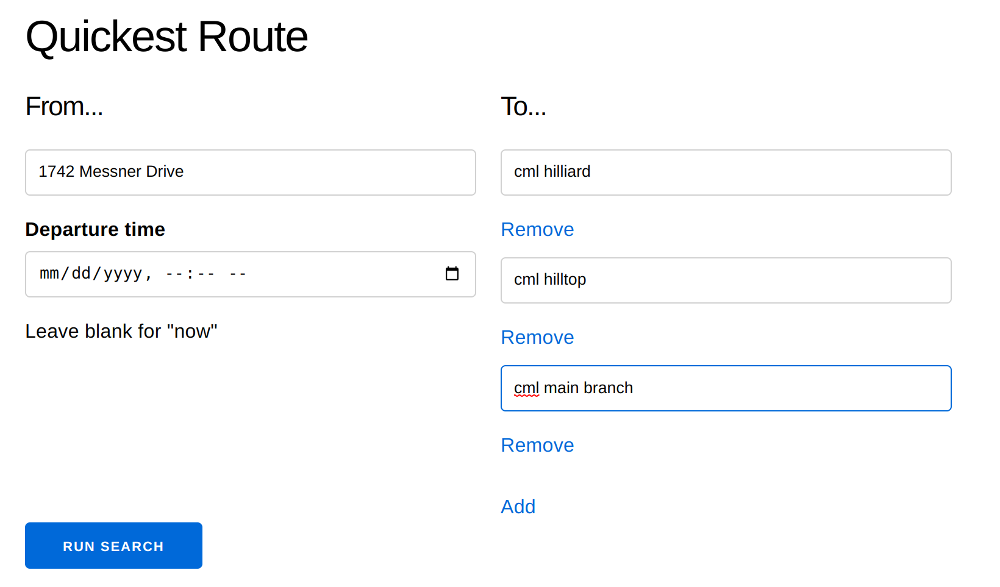
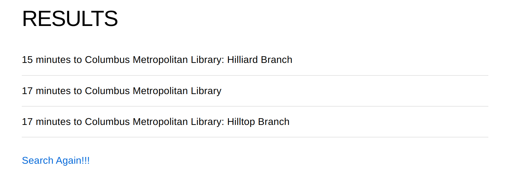

# QuickestRoute

## Origin

It might seem old-fashioned, but I use my public library often. One service they provide is
free tickets to local events, such as the zoo, the symphony, and the herbarium. These
tickets cannot be reserved, however; one must travel to one of several branches that currently
have a ticket. Since I don't necessarily know where each library is located, I need
to check how quickly I can get to each one and choose accordingly.

## Value

This project uses Google's map-related APIs to provide the trip duration
to multiple destinations. This obviates
the need to open several browser tabs, enter the same starting location for each,
and check the results one-by-one.

User specifies an origin, departure time, and alternative destinations

User's alternatives are converted to a `place_id` to improve searching for directions/durations.
User's name is replaced by Google's name for precision.

## Todo

* This should be containerized to facilitate deployment with a service like Fly.io
* Should handle error cases more elegantly
* Generally the search and results pages should look better
* Should have a limit on the number of alternative destinations
* ~~Should make a third input for a fixed final destination~~